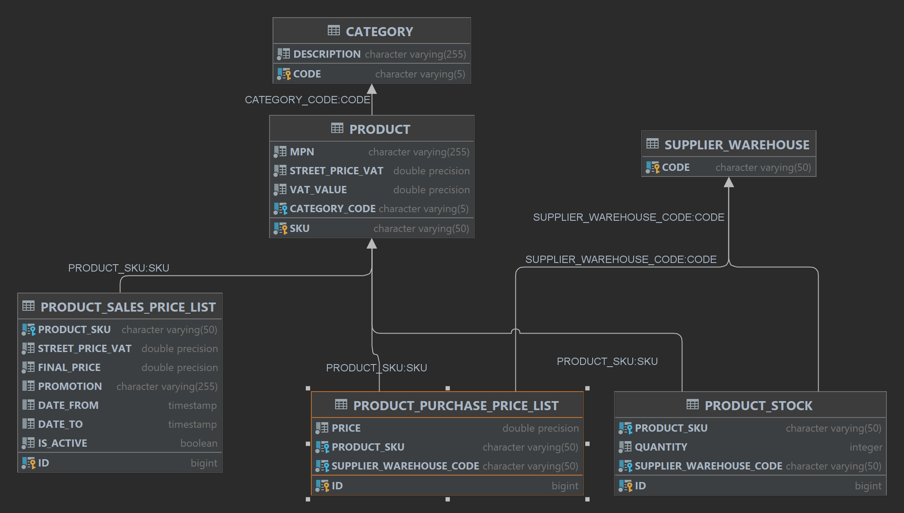

# Monclick Backend Test

## Database

**DB:** H2 (driver version 2.1.212)

**USERNAME:** sa

**PASSWORD:** sa

### Schema

## Commesse

### Avvio del server

- Clonare il progetto 
- Compilare il progetto con il comando mvn clean install
- avviare il server con il comando java -jar .\test-0.0.1-SNAPSHOT.jar --spring.r2dbc.url="r2dbc:h2:file://PATH//TO//database;DB_CLOSE_DELAY=-1"
*** Specificare un file db (non allegato al presente progetto) ***

### Prerequisiti

- utilizzare un linguaggio a scelta compatibile con la JVM ( Java, Kotlin, Scala,...)
- utilizzare un tool di build (Gradle, Maven, SBT,...)
- documentare i requisiti dei software e le procedure di build e run
- caricare il progetto su github

### Webserver REST

Dato il database  *database.mv.db*
* Utilizzando un framework a scelta creare un Webserver che permetta di:
    * Recuperare un prodotto tramite chiave primaria e ritorni nella risposta, oltre il prodotto stesso, tutti gli elementi relazionati ad esso   [^1]
    * Un endpoint di ricerca dei prodotti che permetta di [^2]
        * paginare i risultati
        * ricercare solo i prodotti con stock
        * ricercare i prodotti tramite lista di categorie
        * ricercare i prodotti tramite codice magazzino

***Nice to have***

- Dockerfile o immagine docker generata con build tool 
- Documentazione delle API (openapi, swagger)

### Business logic

#### Richiesta

Il direttore commerciale vuole che vengano calcolati i listini di vendita (PRODUCT_SALES_PRICE_LIST) in modo automatico dal sistema.

Dovra essere presente almeno un listino di vendita per ciascun listino di acquisto.

Chiede che ci sia un listino di vendita di default senza scadenza e una serie di listini promozionali.

I listini promozionali hanno come promotion_code *Offerta* i listini di default invece non hanno codice promozionale.

Ogni listino promozionale avrà una data di inizio e una data di fine.
 
Partendo da tutti i prodotti che hanno un listino di acquisto (PRODUCT_PURCHASE_PRICE_LIST) il sistema deve generare un listino base secondo questi criteri:

Deve prendere lo street price del prodotto e calcolare il prezzo finale togliendo il 10% per tutti i prodotti, al netto di quelli appartenenti alle categorie nella seguente tabella dove deve applicare i valori di sconto applicati.

| CODE | STREET PRICE MARGIN |
| :--- | :-- |
| FIT | 7% |
| FOT | 5% |
| GIO | 3% |
| HDD | 4% |
| HOM | 18% |
| LET | 32% |
| MON | 40% |
| NET | 50% |
| PCN | 1% |
| PIC | 12% |

Successivamente deve controllare che il prezzo finale calcolato, scorporato dall'IVA (utilizzando l'aliquota del prodotto), sia maggiore rispetto al prezzo d'acquisto. 
Se la condizione è rispettata il listino più essere generato. In caso contrario va calcolato un nuovo prezzo finale dato dal minimo tra lo street price e il purchase_price maggiorato del 3%.

Per tutti i prodotti ove è stato generato il listino base andare a generare il listino *Offerta* scontando dell'1% il prezzo finale calcolato solo per le categorie *FIT, HOM, NET* ed impostare la data di validità dalla mezzanotte del giorno successivo all'esecuzione per una durata complessiva di 5 giorni.

Una volta generati i listini il sistema deve determinare il warehouse (SUPPLIER WAREHOUSE) più conveniente per l'azienda e di conseguenza il sistema deve attivare tutti i listini di quel prodotto appartenenti a quel magazzino.
Per determinare il listino attivo vanno seguiti i seguenti criteri:
- Se il prodotto ha più di 50pz sul magazzino *M1* scegliere quello
- Se il prodotto ha tra i suoi magazzini *M2* o *M4* scegliere quello con marginalità maggiore al netto che ci siano almeno 50pz
- Se il prodotto ha tra i suoi magazzi *M1* ed *M2* scegliere quello con stock maggiore
- Altrimenti prendere il magazzino con marginalità maggiore. In caso di parità dare priorità basandosi sull'ordine dei codici magazzino.

### Note
Tutte le colonne di prezzo denominate con il suffisso _VAT sono IVA INCLUSA. Le altre sono IVA ESCLUSA.

Prestare attenzione ai confronti dei prezzi con e senza IVA.

Il database è in gestione al candidato, che può apportare  qualsiasi modifica allo schema. 
Deve essere in grado di giustificare ed argomentare ogni cambiamento.

___________________

[^1]: Prestare molta attenzione ai dati

[^2]: I filtri devono essere in AND
